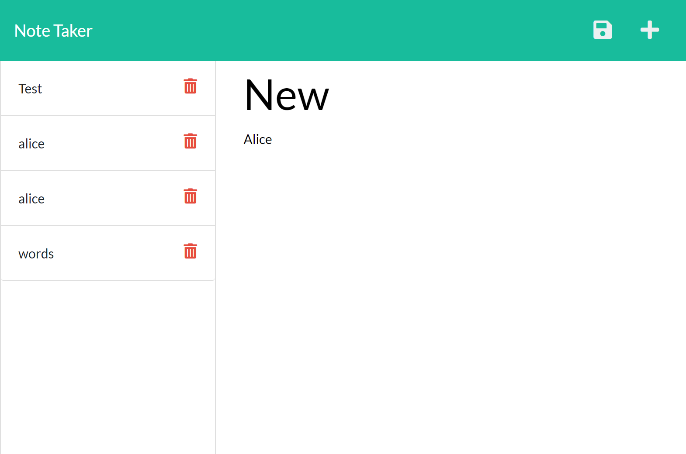
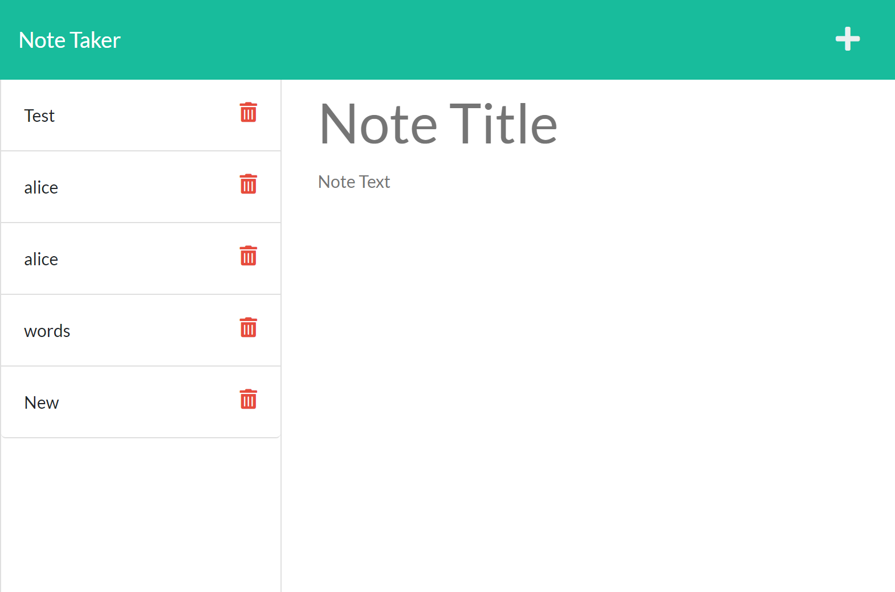

# air-take-notes-kid
Here is my note taking application that I have done using express.js
## Mock-Up
The following images show the web application's appearance and functionality: 
This one shows a new note I would like to add. 
 
This one shows the note added 
 

## Link to App
[Click here to see Team Work Makes the Dream Work in action!](https://alicedebo.github.io/air-take-notes-kid/)